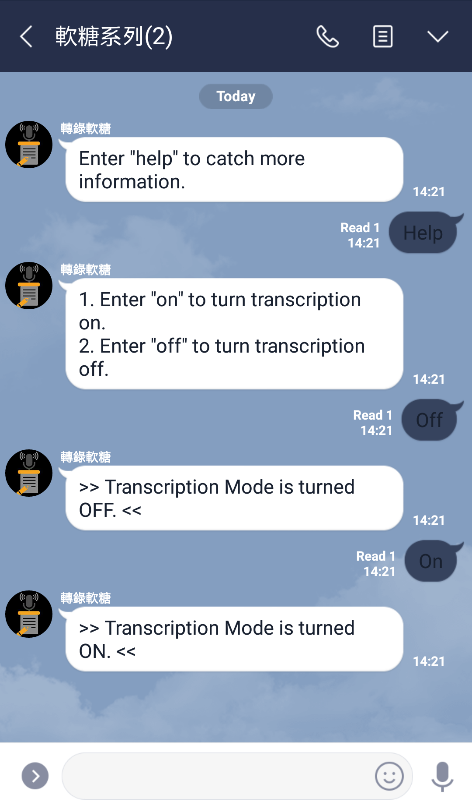
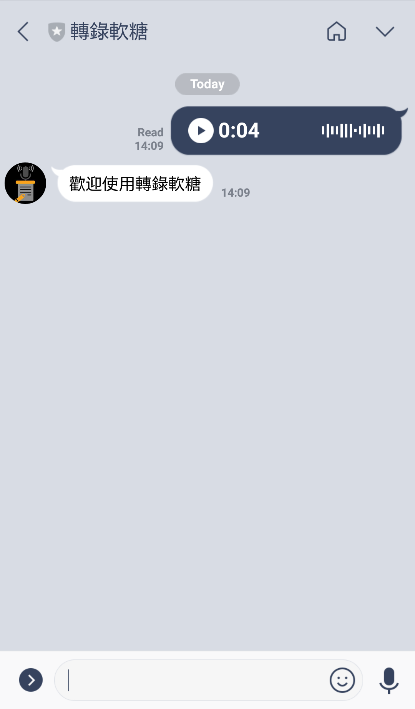

# LINE Transcription Soft Candy

 

## Introduction

This is an auxiliary unofficial bot working on LINE app transforming audio into text messages for reading conveniently.

 

## LINE QR Code

 

 

## How to Use

1. Scan above QR code to add **LINE Transcription Soft Candy** as a friend.
2. Use built-in audio recording feature to send message.
3. **Soft Candy** will transcript previous audio message and reply the text message.

**NOTE**: all messages on the server will be **deleted** immediately after the candy finishes transcription.

 

## Features

1. The candy can be made idle by toggling **on** or **off**.
2. The candy can transcript all audio messages not only in 1:1 chat, but also in a room or a group.
3. The candy is familiar with **Chinese** or **Mandarin** languages.

 

## Screenshots

	
	

 

## Lisence

Apache License 2.0
